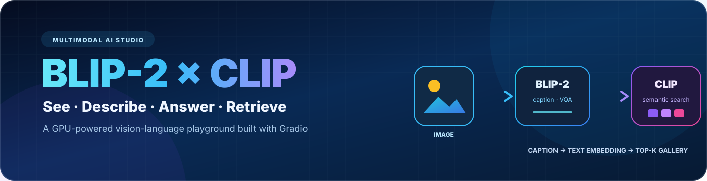
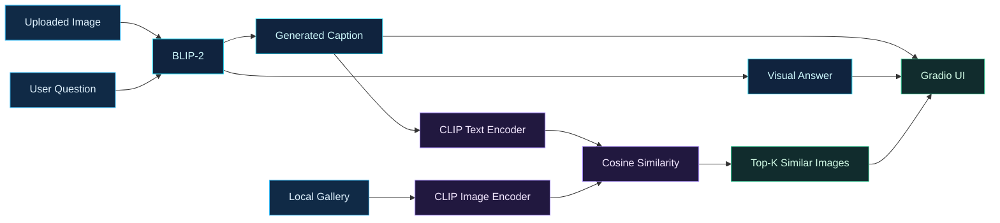

<p align="center">
  
</p>

<h1 align="center">BLIP-2 × CLIP Multimodal Studio</h1>

<p align="center"><strong>Image captioning · Visual question answering · Semantic image retrieval</strong></p>

<p align="center">
  
  
  
  
  
</p>

<p align="center">
  <a href="#-what-it-does">Features</a> ·
  <a href="#-architecture">Architecture</a> ·
  <a href="#-quick-start">Quick Start</a> ·
  <a href="#-project-layout">Code Map</a>
</p>

---

Turn a single uploaded image into three connected multimodal experiences. **BLIP-2** generates a caption and answers natural-language questions; **CLIP** converts that caption into a semantic query and retrieves the most similar images from a local gallery; **Gradio** wraps everything in an interactive web interface.

<p align="center">
  
</p>

## ✨ What it does

| 🖼️ Image Captioning | 💬 Visual Q&A | 🔎 Semantic Retrieval |
|:---:|:---:|:---:|
| Upload an image and generate a natural-language description | Ask a free-form question grounded in the image | Use the generated caption to search a local image gallery |
| `Salesforce/blip2-opt-2.7b` | Prompt-conditioned BLIP-2 generation | `openai/clip-vit-base-patch32` cosine similarity |

## 🧩 Architecture



The gallery index is built once at startup. Each gallery image is encoded and normalized with CLIP; for every request, the generated caption is encoded as text and ranked against those image vectors with cosine similarity.

## 🚀 Quick start

### 1. Clone and install

```bash
git clone https://github.com/JiangYubo4399/BLIP-2-CLIP-Multimodal.git
cd BLIP-2-CLIP-Multimodal

python -m venv .venv
source .venv/bin/activate

pip install -r requirements.txt
pip install bitsandbytes
```

The default BLIP-2 wrapper uses 8-bit loading, so `bitsandbytes` is required in addition to the packages listed in `requirements.txt`.

### 2. Add gallery images

Place `.jpg` or `.png` files in:

```text
assets/gallery/
```

The repository includes a small example gallery. Its CLIP embeddings are computed automatically when the app starts.

### 3. Launch

```bash
python demo.py
```

Open the local Gradio URL, upload an image, enter a question, and click **Run**. The interface returns a caption, a visual answer, the top three gallery matches, and the caption used as the retrieval query.

## 🧠 Models

| Component | Default checkpoint | Role |
|---|---|---|
| BLIP-2 | `Salesforce/blip2-opt-2.7b` | Caption generation and visual question answering |
| CLIP | `openai/clip-vit-base-patch32` | Text/image embeddings and semantic retrieval |

Model weights are downloaded from Hugging Face on first launch and are not stored in this repository.

## ⚙️ Runtime notes

> [!IMPORTANT]
> The current configuration is designed for a CUDA-enabled environment. BLIP-2 loads with `device_map="auto"`, FP16 weights, and 8-bit quantization; CLIP is placed on the available CUDA device when using `models/clip_retriever.py`.

- On multi-GPU systems, `device_map="auto"` can distribute BLIP-2 automatically.
- Initial startup may take several minutes while model weights download and the gallery index is built.
- GPU memory usage depends on the selected BLIP-2 checkpoint and gallery size.
- `MemoryManager` provides an optional three-turn conversation history helper, though the default Gradio flow uses single-turn Q&A.

## 🗺️ Project layout

```text
BLIP-2-CLIP-Multimodal/
├── demo.py                       # Gradio application and end-to-end pipeline
├── models/
│   ├── blip2_wrapper.py          # BLIP-2 captioning and VQA wrapper
│   ├── clip_retriever.py         # standalone CLIP retrieval helpers
│   └── memory_prompt.py          # optional short conversation memory
├── utils/
│   └── retrieval.py              # gallery indexing and top-k retrieval
├── assets/
│   ├── blip2-clip-banner.svg     # README artwork
│   └── gallery/                  # local retrieval gallery
├── requirements.txt
└── README.md
```

## 🤝 Contributing

Issues and pull requests are welcome. Useful additions include batched gallery indexing, persistent vector caches, configurable checkpoints, CPU-safe loading, and richer multi-turn interaction.

## 📄 License

This project is released under the MIT License.

---

<p align="center"><strong>One image in. Captions, answers, and visual discovery out.</strong></p>
